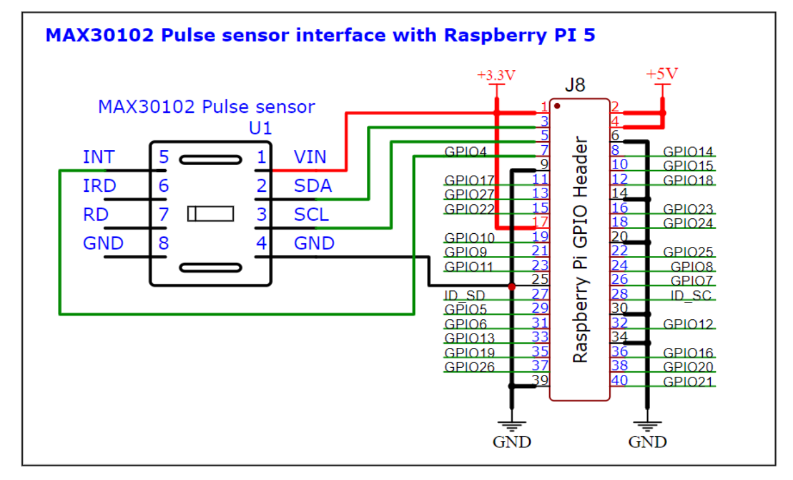
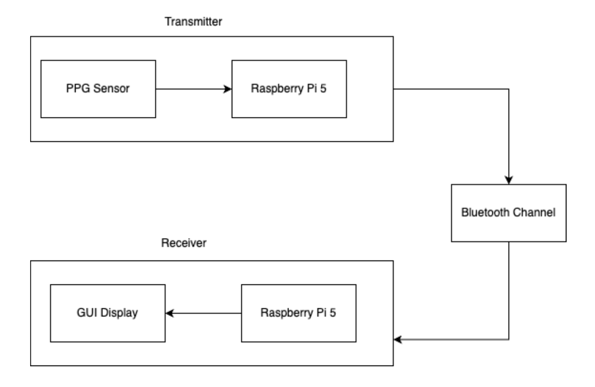
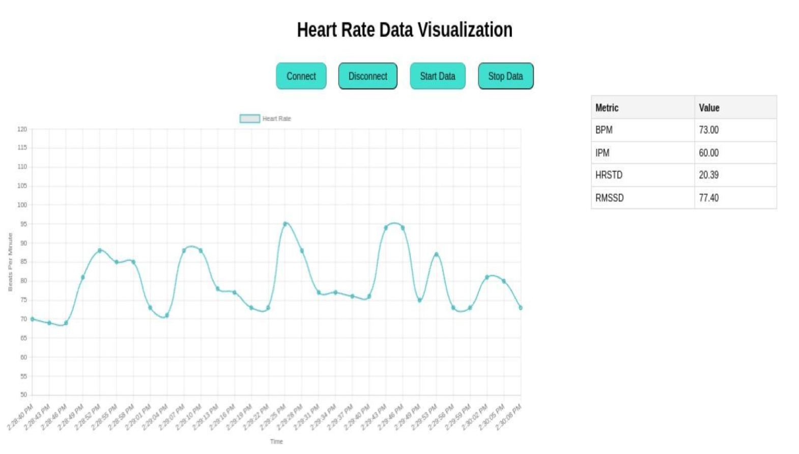

# 🫀 Wireless Pulse Monitoring System

## Objective
This project implements a wireless pulse monitoring system using two Raspberry Pi 5 devices connected via Bluetooth. A MAX30102 PPG sensor is used to collect physiological signals, which are transmitted from the transmitter Pi to the receiver Pi. The receiver processes the data and displays real-time health metrics through an interactive GUI.

---

### **Transmitter Raspberry Pi (PPG Sensor + Bluetooth Server):**

- **Sensor Data Collection (MAX30102):**
  - The transmitter Raspberry Pi reads IR and RED light values from the MAX30102 PPG sensor.
  - These raw readings are used to compute:
    - Heart Rate (HR)
    - SpO₂
    - RMSSD (Heart Rate Variability)
    - HRSTD (Standard Deviation of HR)

- **Data Processing:**
  - The signal is processed to extract peaks, compute averages, HRV features, and validate readings.
  - Only valid readings are packaged into JSON format.

- **Bluetooth Data Transmission:**
  - The transmitter Pi acts as a Bluetooth server.
  - A custom 3-step handshake is used to ensure synchronization:
    - `START_SYNC`  
    - `ACK`  
    - `ACK_ACK`
  - After sync, the device streams JSON packets every second.

- **Server Code Structure:**
  - `server.py` — Main server loop + Bluetooth data stream  
  - `max30102.py` — Raw sensor reads  
  - `hrcalc.py` — HR & SpO₂ computation logic  

---

### **Receiver Raspberry Pi (Bluetooth Client + GUI Backend):**

- **Bluetooth Connection Management:**
  - The receiver device runs a Bluetooth client that:
    - Connects to the server Pi
    - Initiates synchronization
    - Receives JSON packets continuously
    - Handles disconnects and error recovery

- **Flask Backend for GUI:**
  - The receiver exposes API endpoints:
    - `/connect` — Establish Bluetooth link  
    - `/disconnect` — Close connection  
    - `/start` — Begin receiving live sensor data  
    - `/stop` — Stop streaming  
    - `/get_pulse_data` — Fetch current vitals  

- **Data Processing:**
  - Incoming JSON packets are parsed to extract:
    - Beats per minute (BPM)
    - Impulses per minute (IPM)
    - RMSSD values
    - HRSTD values
  - These values are stored and served to the GUI.

- **Receiver Code Structure:**
  - `client.py` — Bluetooth logic + Flask backend  
  - `index.html` — GUI  
  - `style.css` — Interface styling  

---

### **Graphical User Interface (GUI):**

- **Control Buttons:**
  - **Connect** — Establish Bluetooth link  
  - **Disconnect** — Terminate connection  
  - **Start** — Begin data stream  
  - **Stop** — Stop receiving data  

- **Real-Time BPM Chart:**
  - Displays a scrolling graph of BPM vs time
  - Only the last 30 samples are kept (rolling window)
  - Chart updates every 2 seconds

- **Vitals Block:**
  - **BPM** — Beats Per Minute  
  - **IPM** — Impulses Per Minute  
  - **RMSSD** — Heart Rate Variability metric  
  - **HRSTD** — Standard deviation of HR  

---

### **Hardware Setup (PPG Sensor → Raspberry Pi 5):**

| PPG Sensor Pin | Raspberry Pi Pin |
|----------------|------------------|
| GND            | GND              |
| VIN            | 3.3V             |
| SDA            | SDA1             |
| SCL            | SCL1             |
| INT            | GPIO4            |

---

### **System Architecture:**



---

### **Bluetooth Data Pipeline:**



---

### **Code Execution Flow**

**Transmitter (Server Side):**

- Initialize Bluetooth server
- Wait for client
- Sync handshake (START → ACK → ACK_ACK)
- Start PPG sensor read loop
- Compute HR, SpO₂, RMSSD, HRSTD
- Stream JSON packets until STOP command

**Receiver (Client Side):**

- Connect to server via `/connect`
- Begin stream via `/start`
- Collect incoming JSON data
- Update GUI every 2 seconds
- Plot BPM graph + update vitals

---

### **Example JSON Packet:**

```json
{
  "pulse": 85,
  "impulses_per_minute": 72,
  "beats_per_minute": 80,
  "rmssd": 38.4,
  "hrstd": 4.7
}
````

---

### **Running the System**

#### **On Transmitter Raspberry Pi 5:**

```bash
cd Server
python3 server.py
```

#### **On Receiver Raspberry Pi 5:**

```bash
cd Client
python3 client.py
```

Open the GUI:

```bash
xdg-open index.html
```

---

### **GUI Dashboard:**



---

### **Folder Structure**

```
Wireless-Pulse-Monitoring/
│
├── Client/
│   ├── client.py
│   ├── index.html
│   ├── style.css
│
├── Server/
│   ├── server.py
│   ├── max30102.py
│   ├── hrcalc.py
│
├── images/
│   ├── architecture.png
│   ├── data_flow.png
│   ├── gui_dashboard.png
│
├── ECPS_205_Final_Report.pdf
├── WSAN_PROJECT_Requirements.pdf
└── README.md
```

---

### **Results:**


---

### **Demo:**

Link: [https://drive.google.com/file/d/18IRrI4MpeUbWc3CTB0dZtUQCziCY4v9t/view?usp=sharing](https://drive.google.com/file/d/18IRrI4MpeUbWc3CTB0dZtUQCziCY4v9t/view?usp=sharing)

---

### **Future Enhancements:**

* BLE (Bluetooth Low Energy) support
* Cloud logging (Firebase, MongoDB)
* Historical charts + analytics
* Mobile app interface
* Adaptive HRV filtering
* TensorRT/NEON optimization

```